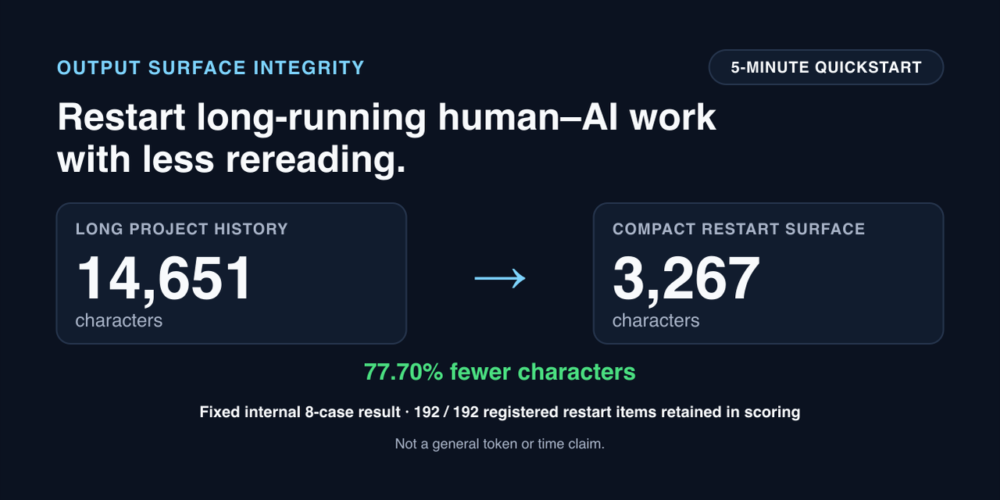

# Output Surface Integrity

[](LICENSE)
[](README.md)
[](docs/quick-use.md#one-minute-check)

Output Surface Integrity is a restart-oriented compression method for long-running human–AI work. It reduces the amount of prior material a receiving person or AI must reread by preserving only the operational state required to continue.

[](docs/quick-use.md#one-minute-check)

**[Run the one-minute restart check →](docs/quick-use.md#one-minute-check)**

## See the Restart Difference

```text
Long project history
14,651 characters across eight fixed internal cases
        ↓ OSI
Compact restart surface
3,267 characters
        ↓
77.70% fewer characters
192 / 192 registered restart items retained in scoring
```

The compact restart surface preserves the answers needed for bounded continuation:

- What changed?
- What remains unresolved?
- Where should work restart?
- Who owns the next action?

A new human or AI can continue from the bounded operational state instead of reconstructing the entire project history.

## One Output Before and After OSI

**Illustrative Level 1 example — not part of the measured eight-case result.**

**Before**

> Done. The repository was updated and tests passed.

This does not reveal the changed surface, evidence, unresolved state, restart point, or next owner.

**After**

- Output reference: `PATCH-001`
- Changed surface: `src/parser.ts`; `tests/parser.test.ts`
- Validation receipt: `RECEIPT-001` — `PASS`
- Missing closure: `NONE` within the named Level 1 boundary
- Restart point: state immediately before `PATCH-001`
- Next action: accept the bounded parser maintenance change
- Next owner: receiving maintainer
- Gate: `PASS`

For a stronger completion check, continue to the [full five-minute workflow and template](docs/quick-use.md#full-five-minute-workflow).

No installation, blind evaluation, Gold, Mapping, or multi-agent setup is required for the Level 1 workflow.

## Measurement Boundary

This result is limited to the fixed internal eight-case evaluation. It does not establish a general token-reduction rate, general time savings, equivalent effects in external environments, market demand, or superiority over other context-transfer methods.

## From Less Rereading to Controlled Continuation

OSI's supporting layers follow this order:

1. **V11 — Reconnectability:** retain the operational state required for restart and connect it to its origin, As-of condition, stop condition, and rollback or re-entry path.
2. **V12 — Completion Integrity:** prevent false completion and responsibility loss by preserving evidence, authority, ownership, unresolved state, and bounded acceptance.
3. **V13 — Next-Loop Governance:** fix the next safe action, next owner, and conditions for re-entry.

V11, V12, and V13 support the restart-oriented compression method. They do not make restart automatic or establish universal reliability.

## Why This Matters

Long-running human–AI work often creates the same restart costs repeatedly:

- A new AI needs the same project explanation again.
- The agent says “done,” but you still have to verify and clean up.
- The reason behind an earlier decision disappears with the previous chat.
- A handoff transfers information but creates more work.
- Nobody can tell what was actually checked, what remains unresolved, or where to restart.
- Adding more agents makes you carry more project state, not less.

## This Is Not Only Context Loss

The previous AI may have produced an output without leaving a completion state that the next human or AI can safely accept, verify, roll back, and continue.

That is **False Completion**: the work looks finished locally while missing evidence, unresolved state, and ownership are transferred downstream.

## What OSI Does

OSI compacts the continuation surface: the bounded outcome, evidence required for the next judgment, unresolved state, authority, rollback or restart point, and next owner.

It is designed to reduce repeated explanation and recovery without discarding the state needed to restart safely. It is not designed to make every isolated turn shorter, and the fixed internal result above is not a universal performance estimate.

When the required state is preserved, OSI prevents repeated reconstruction by shifting work from repeated recovery to bounded one-time recording. This is an operating mechanism, not an experimentally measured saving.

## Cost Now / Cost Later

| Without OSI | With OSI |
| --- | --- |
| AI says “done” | Exact output is frozen |
| Evidence is incomplete | Evidence and procedure are recorded |
| The next session reconstructs state | Restart state is inherited |
| Verification is repeated | Prior verification remains inspectable |
| Ownership is unclear | The next owner is named |
| Mistakes create repair work | Missing Closure blocks unsafe continuation |

OSI pays a bounded integrity cost once. Missing completion state may otherwise be paid for repeatedly by every later human, model, session, or agent.

This is an operating mechanism, not a published percentage effect.

## One Ordinary Example

### AI claim

> Done. The repository was updated and the tests passed.

### Missing closure

- exact changed paths are absent;
- the test command and execution receipt are absent;
- the rollback or restart point is absent;
- unresolved assumptions are hidden; and
- the next safe action and owner are absent.

### OSI result

`DELAY`

The semantic claim may be correct, but receipt and completion integrity are not yet sufficient to accept “done.”

Closure would require a stable output reference, the exact changed paths, the actual validation command and result, any required independent closure state, unresolved assumptions, a rollback/restart point, and a named owner for the next safe action.

Without that record, the next session must rediscover the state. With it, the next human or AI can inspect the missing closure and resume at the bounded action without pretending the change failed.

See the [completed Level 1 example](docs/quick-use.md#completed-example).

## What OSI Changes

OSI separates an answer from the state required to accept, transfer, audit, or resume it.

| Integrity surface | Question it answers |
| --- | --- |
| Semantic outcome | What did the AI conclude, including uncertainty? |
| Output identity | Which exact response, patch, commit, file, or artifact is being evaluated? |
| Evidence / receipt integrity | Which executions and validations have inspectable results? |
| Procedure integrity | Were the required steps, ordering, and boundaries followed? |
| Authority | Who was allowed to perform or approve the action? |
| Witness state | Was independent fixation required, and was it completed? |
| Unresolved items | What remains unknown, missing, or contradictory? |
| Rollback / restart point | Where can work be reversed or safely resumed? |
| Next owner | Who owns the next bounded action or judgment? |
| Gate | Is bounded acceptance `PASS`, `DELAY`, or `BLOCK`? |

The difference is:

> The AI produced an answer.

versus:

> This exact output was produced under this authority, with this evidence, these unresolved items, this Witness state, and this safe continuation path.

## What Makes an AI Completion Trustworthy?

> As AI work becomes more autonomous and complex, what will serve as the basis for trusting that the work is actually complete?

OSI does not ask you to trust fluent output, model confidence, model reputation, the author's credentials, or an unverified “done” report. It asks you to inspect:

- exact artifact identity;
- evidence and execution receipts;
- procedure and authority;
- Witness or independent closure state;
- unresolved items;
- rollback or restart point; and
- the next action and owner.

That record does not guarantee that a conclusion is true. It makes the acceptance basis visible, makes missing closure explicit, and gives the next human or AI a bounded place to continue.

**OSI does not make trust automatic. It makes trust inspectable.**

## Why the Upfront Cost Can Pay Back

The integrity record is created once. Without it, every new chat, model, agent, or maintainer may inherit the same missing context and repeat the same search, verification, explanation, and coordination work.

A slightly slower close can therefore be cheaper than repeated recovery. Preserving state also limits unsafe momentum: when evidence, authority, ownership, or the restart point is absent, the Gate can stop continuation before an omission compounds into broader repair work.

This is the project's long-run cost hypothesis and operating rationale. Comparative total-workflow savings have not yet been measured.

## Evidence: Measured and Not Yet Measured

### Verified integrity evidence

| Verified fact | Recorded value |
| --- | ---: |
| Runtime executions | `18 / 18` |
| Witness fixations | `18 / 18` |
| Primary Evaluator evaluations | exactly `1` |
| Evaluated B-IDs | `18 / 18` |
| PE rerun / replacement | `0 / 0` |
| Gold / Mapping access before Ledger freeze | `0 / 0` |
| Runtime / Ledger modification | `0 / 0` |
| Later V11+V12 validator-side result | `7 PASS / 1 DELAY / 0 BLOCK` |

These counts show integrity and exactly-once discipline. They are not efficiency effect sizes.

### Fixed internal representation results

| Fixed corpus | Full | Compact | Saved | Recorded reduction | n |
| --- | ---: | ---: | ---: | ---: | ---: |
| Candidate reports | `14,651` characters | `3,267` | `11,384` | `77.70%` | `8` |
| Synthetic adversarial reports | `24,711` characters | `10,763` | `13,948` | `56.44%` | `8` |

These are character-count results for two fixed internal runs with registered rubric reconstruction. They are not token, time, total-cost, handoff, safety, or external-performance measurements. See the [Claim Boundary](CLAIM_BOUNDARY.md), [registered measured facts](evaluation/osi_rtk_native_domain_v0.2/comparison_interpretation_packet_v0.1/measured_score_facts.json), and [native-domain protocol](notes/osi_rtk_native_domain_comparison_protocol_v0.2.md).

### Not measured or not completed

- percentage token or elapsed-time reduction;
- percentage self-verification or correction-loop reduction;
- re-onboarding time, handoff success rate, or human monitoring reduction;
- comparative productivity or accuracy gain;
- deployment safety or general real-world performance;
- comparative market demand;
- total continuation cost or a comparative effect against RTK;
- Blind Evaluation of the later `7 PASS / 1 DELAY / 0 BLOCK` result;
- Primary rubric scoring of that later result; and
- the FR-v0.2.1-01 final blind score.

## Public Claims

| Category | Current boundary |
| --- | --- |
| **SUPPORTED** | Fixed internal eight-case character reduction of `77.70%`.<br>`192 / 192` registered items preserved in scoring.<br>Repository and Formal Run facts that can be directly verified. |
| **NOT ESTABLISHED** | General token reduction.<br>General time reduction.<br>Equivalent effects in external environments.<br>Market demand.<br>RTK superiority.<br>Universal handoff reliability. |
| **PROHIBITED** | Reopening or retrospectively repairing FR-v0.2.1-01.<br>Rewriting private evidence chronology.<br>Presenting Scientific Missing Closure as resolved.<br>Converting lack of external response into demand rejection. |

### Evidence That Pressures the Hypothesis

The repository also preserves adverse historical evidence. In an earlier fixed native-domain comparison, RTK produced the correct registered bounded state at Execution Stage 2 in `8 / 8` cases; OSI Responsibility Stage 2 produced the correct bounded state in `1 / 8`, with `14` critical failure events across `7` cases.

The lanes used different native artifacts and rubrics, so these figures are not a winner score and do not establish responsibility equivalence or total continuation cost. They do pressure a blanket “OSI by default” claim. See the [registered measured facts](evaluation/osi_rtk_native_domain_v0.2/comparison_interpretation_packet_v0.1/measured_score_facts.json) and [native-domain protocol](notes/osi_rtk_native_domain_comparison_protocol_v0.2.md).

### Forward-Only Architecture Correction

The `1 / 8` result remains a valid As-of finding; it was not treated as a stable limit of OSI or rewritten after the fact. Shin identified the missing joint as V11 Reconnectability: Responsibility Surface control alone did not preserve all conditions needed to reconnect judgment-critical state to its origin, stop condition, and rollback/re-entry path.

A later preregistered Compound Gate v0.2 added:

- Gate A: V11 Reconnectability Gate; and
- Gate B: V12 Responsibility Surface Gate.

The registered validator-side Compound Gate for `attempt_02` produced:

- PASS: `7 / 8`;
- DELAY: `1 / 8`; and
- BLOCK: `0 / 8`.

R07 remained `DELAY` because the permitted evidence did not supply the required rollback/re-entry trigger or re-evaluation conditions. Those conditions were not retrospectively invented to force `PASS`.

This is substantial Forward-only architectural recovery from the earlier `1 / 8` result. It is not evidence of complete `8 / 8` recovery: Blind Evaluation was `NOT RUN`, Primary rubric scoring was `NOT RUN`, and no comparative effect size, main empirical Claim confirmation, or RTK superiority is claimed.

## What OSI Returns

| Output | Plain meaning |
| --- | --- |
| Semantic outcome | What the AI or Runtime concluded, including uncertainty. |
| Receipt integrity | Whether claimed execution and validation have inspectable evidence. |
| Procedure integrity | Whether authorized steps, ordering, and boundaries were followed. |
| Witness state | Whether independent fixation was required and completed. |
| Gate | `PASS`, `DELAY`, or `BLOCK`. |
| Missing Closure | What still prevents bounded acceptance. |
| Next safe action | The bounded point where work may continue or restart. |
| Next owner | The human, agent, or role responsible for that action or judgment. |

- `PASS` means the bounded completion claim is supported well enough for the stated acceptance decision; it is not proof of truth.
- `DELAY` means closure may be reachable after specified evidence or verification is obtained; it is not failure.
- `BLOCK` means accepting or continuing would cross an integrity or authority boundary; it is not punishment.

The purpose is not to force `PASS`. The purpose is to prevent False Completion and preserve a safe continuation path.

## Choose the Right Level

### Level 1 — Everyday Output Check

Use for one AI output, coding task, completion report, or ordinary handoff. Record the minimum inspectable completion state in minutes using the [quick-use template](docs/quick-use.md).

### Level 2 — Repository / Handoff Integrity

Use for state-changing work across sessions: identify changed files or systems, evidence, authority, unresolved assumptions, rollback, current owner, and the receiving owner's restart point.

Useful public references: the [quick-use template](docs/quick-use.md), [Claim Boundary](CLAIM_BOUNDARY.md), and [canonical failure record](experiments/osi_failure_forward_delta_ledger_v0_1/failure_forward_delta_ledger_v0.1.md#hl-012--fr-v021-01-completion-integrity-failure-record).

### Level 3 — Long-Running Multi-Agent Work

Use when many chats, models, agents, or extended project phases share responsibility. Preserve As-of state, role boundaries, active and parked lines, exactly-once requirements, and the next Gate so continuation does not run on momentum.

### Level 4 — Formal Evaluation

Use for preregistered blind research involving multiple roles, Runtime execution, independent Witness fixation, committed Gold, private Mapping, controlled reveal, and final comparison.

Level 4 has materially higher setup and custody cost. Reveal artifacts, manifests, commitments, owners, and retrieval routes must be proven before Runtime begins. [FR-v0.2.1-01](#formal-run-fr-v021-01) shows why commitment existence alone is not reveal readiness.

**Most users should begin at Level 1.** The Formal Run is evidence and an advanced reference, not the entry cost for using OSI.

## RTK and OSI: Use the Level the Work Requires

OSI overlaps with restart and context-transfer approaches such as RTK in the broad problem it addresses. OSI’s bounded contribution here is narrower: it evaluates whether a compact operational surface can preserve preregistered restart-relevant items across fixed internal cases. This repository does not claim superiority over RTK or equivalent performance outside the registered evaluation.

For RTK itself, use the [authoritative RTK repository](https://github.com/rtk-ai/rtk). The clean public projection contains no executable RTK artifact; the [evidence boundary](evidence/README.md) identifies the fixed artifact retained only in the private research archive.

## Why Inspect This Work?

This is independent work. You do not need to trust an affiliation, credential, or confident claim.

You can inspect:

- the published Forward-only correction and failure chronology;
- [schemas and templates](docs/quick-use.md#copy-paste-template);
- the lightweight adoption path and completed example;
- Formal Run counts and the frozen Ledger identity;
- the preserved terminal `BLOCK`;
- the [failure chronology](experiments/osi_failure_forward_delta_ledger_v0_1/failure_forward_delta_ledger_v0.1.md);
- published evidence hashes and registered methods; and
- explicit measured, inferred, hypothesized, and unmeasured boundaries.

The failure record is not a claim of empirical success. It is evidence that the project did not rewrite the past, reconstruct unavailable custody artifacts, or manufacture a final score after a completion joint failed.

Readers can inspect the artifacts and reach a different interpretation. Inspectability is the credibility path; author status is not.

**Do not trust the author's status. Inspect the system's evidence and boundaries.**

## Formal Run FR-v0.2.1-01

This Formal Run is a subordinate completion-integrity record. Its terminal `BLOCK` is not project failure or full scientific validation. FR-v0.2.1-01 preserved pre-unblinding blindness and completed Runtime, Witness, and exactly-once Primary Evaluator observation, but it did not complete the post-unblinding comparison because the pre-existing Gold / Mapping source binding could not be proven.

| Field | Final state |
| --- | --- |
| Formal Run | `FR-v0.2.1-01` |
| Terminal Gate | `BLOCK — TERMINALLY CLOSED` |
| Runtime | `18 / 18` |
| Witness | `18 / 18` |
| Primary Evaluator | Exactly `1`, over `18 / 18` B-IDs |
| Blind Observation Ledger | `FROZEN` — SHA-256 `176da386cc4aefe481ecf1fe13b7e60c0d051e440c403da2866fa3434e7968d0` |
| Pre-freeze Gold / Mapping access | `0 / 0` |
| PE rerun / replacement | `0 / 0` |
| Runtime / Ledger modification | `0 / 0` |
| Final blind score | `NOT COMPUTABLE` |
| Operational Missing Closure | `NONE` |
| Scientific Missing Closure | `pre-existing Gold / Mapping source binding` |
| Claim | `PRESSURED — UNCHANGED` |
| Falsifier | `UNRESOLVED — UNCHANGED` |

The run remains terminally closed. No reopening, Gold or Mapping reconstruction, retrospective commitment repair, rerun, or replacement is permitted.

### What Completed

- all 18 Runtime executions and all 18 Witness fixations;
- exactly one Primary Evaluator observation over B001–B018;
- Blind Observation Ledger freeze before any Gold or Mapping access; and
- preservation with no rerun, replacement, Runtime modification, or Ledger modification.

### What Blocked

The pre-existing authoritative Gold and Mapping reveal sources, manifests, custody receipts, and retrieval bindings were not provably available. Gold/Mapping agreement comparison could not begin.

### What Remains Valid

- Runtime and Witness `18 / 18`;
- the frozen Blind Observation Ledger and its identity;
- pre-unblinding blindness;
- exactly-once PE observation; and
- the no-repair, no-rerun, and no-replacement record.

### What Cannot Be Claimed

- Gold-to-Ledger or Mapping-to-Ledger agreement;
- a final blind score;
- evidence-based Claim or Falsifier resolution; or
- successful end-to-end Formal Run completion.

`BLINDING FAILURE / BLOCK` does not mean that the Primary Evaluator saw Gold or Mapping before Ledger freeze. Pre-unblinding blindness was preserved. The complete blind protocol could not validly close because authoritative reveal-source bindings were not proven.

See the [canonical FR-v0.2.1-01 failure record](experiments/osi_failure_forward_delta_ledger_v0_1/failure_forward_delta_ledger_v0.1.md#hl-012--fr-v021-01-completion-integrity-failure-record).

## Why the BLOCK Matters

Execution completion is not evaluation completion. A commitment's recorded existence is not the same as provable reveal readiness. The final evidence joint is part of the Completion Line.

Retrospective Gold or Mapping reconstruction was rejected because a new artifact could not prove what had been committed before blind evaluation. OSI therefore blocked its own Formal Run instead of forcing `PASS`, while preserving the phases and evidence that did complete.

This does not prove OSI's empirical performance. It directly demonstrates the protocol's refusal to convert incomplete closure into a success claim—the behavior OSI calls prevention of False Completion.

## Repository Map

### Start here

- [Project README](README.md) — value, trust model, usage levels, evidence, and limits.
- [Quick use](docs/quick-use.md) — one-output template, Gate guide, completed example, and AI prompt.

### Templates / schemas

- [Level 1 copy-paste template](docs/quick-use.md#copy-paste-template).
- [Formal compact 12-field schema](evidence/osi_rtk_native_domain_v0.2/osi_readiness/schema_v0.2.0.md) — Level 4 research schema, not a Level 1 requirement.

### Examples

- [Completed everyday example](docs/quick-use.md#completed-example).

### Formal evaluation

- [Native-domain comparison protocol](notes/osi_rtk_native_domain_comparison_protocol_v0.2.md).
- [Registered measured facts](evaluation/osi_rtk_native_domain_v0.2/comparison_interpretation_packet_v0.1/measured_score_facts.json).

### Evidence and incident record

- [FR-v0.2.1-01 failure record](experiments/osi_failure_forward_delta_ledger_v0_1/failure_forward_delta_ledger_v0.1.md#hl-012--fr-v021-01-completion-integrity-failure-record).
- [Claim Boundary](CLAIM_BOUNDARY.md).

### Research background

- [Responsibility-weighted OSI/RTK positioning](notes/responsibility_weighted_osi_rtk_positioning.md).

## Contributing and Reporting

- [Contributing guide](CONTRIBUTING.md)
- [Code of Conduct](CODE_OF_CONDUCT.md)
- [Security and private disclosure guidance](SECURITY.md)
- [Support guidance](SUPPORT.md)
- [Issue templates](.github/ISSUE_TEMPLATE/)

## License

This clean public release surface is available under the [MIT License](LICENSE).

## Limits and Non-Goals

[](#limits-and-non-goals)
[](#what-makes-an-ai-completion-trustworthy)
[](#formal-run-fr-v021-01)

- OSI does not guarantee truth, universal correctness, or safe deployment.
- OSI does not replace tests, CI, formal verification, review, or human judgment.
- Not all work needs the full protocol; Level 1 is the ordinary starting point and a simple note may be enough when no acceptance boundary exists.
- The repository has not measured percentage reductions in tokens, time, self-verification, correction loops, monitoring, or total workflow cost.
- The fixed character-count findings are internal bounded results, not general performance or productivity claims.
- FR-v0.2.1-01 has no final blind score and did not complete end-to-end.
- The repository does not establish OSI or RTK superiority, product readiness, market validation, or universal performance.
- The research evidence is not independent third-party validation.
- Inspectable evidence does not eliminate judgment; it exposes the basis and boundaries for judgment.
- The MIT license governs this clean public release surface; it does not alter the evidentiary limits above.
- No GitHub Release, tag, or external announcement is implied by this initial repository publication.
