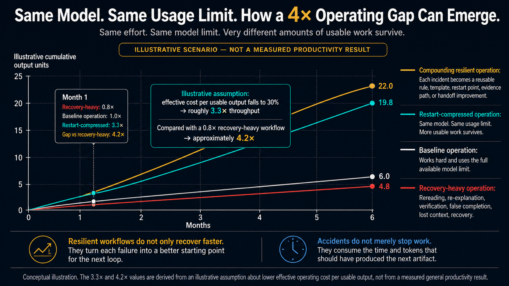

# How a 4× Operating Gap Can Emerge

## Boundary

This is an **illustrative operating scenario**, not a measured general productivity result.

The scenario assumes:

- ordinary top-model operation produces `1.0×` effective output;
- recovery-heavy operation retains `0.8×` after rereading, re-explanation, verification, false completion, lost context, and recovery;
- effective operating cost per usable output falls to `30%`, yielding approximately `3.3×` throughput under the same usage limit; and
- `3.3 ÷ 0.8 ≈ 4.2`, producing the illustrated operating gap.

The measured OSI result is narrower: `14,651 → 3,267` characters, a `77.70%` character reduction, with `192 / 192` registered restart items retained in scoring across a fixed internal eight-case evaluation.

The complete public reproduction package for this internal evaluation is not currently included in the repository.

That measured result is **not** a general token-reduction, time-saving, productivity, external-equivalence, or market-demand claim.

## Core idea

The strongest operators do not only generate more output. They preserve more usable output and turn failures into a better starting condition for the next loop.
